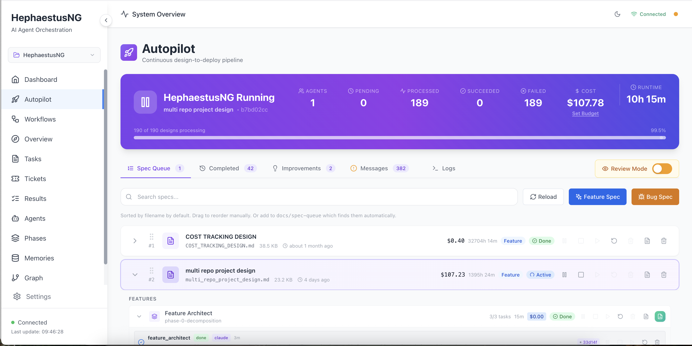

# 🔥 Hephaestus NG — Autopilot: From Spec to Shipped Feature, Unattended

<div align="center">


**Point it at a design spec. Get back a deployed, tested feature — built and verified end-to-end by a pipeline of AI agents that check each other's work at every step, with nobody watching.**

[Examples](example_workflows/) • [Issue Tracker](https://github.com/hmuhlestein/HephaestusNG/issues) • [Original Hephaestus](https://github.com/Ido-Levi/Hephaestus)

</div>

---

## 🤖 Autopilot

Most "autonomous coding agents" write code. Autopilot goes further: it builds hands-free battle-hardened production-ready code. Give it a one or more design specs and it runs a 14-phase pipeline — each phase a focused agent, each phase's claim of "done" checked before the next one starts, and is able to go back to any previous step when something doesn't hold up.

<div align="center">

<p><em>Autopilot's live dashboard: design queue, feature gallery, and per-phase status for every running project</em></p>
</div>

| # | Phase | What it does |
|---|-------|---------------|
| 1 | `product_requirements` | Extracts structured requirements from the design spec, with full project context. |
| 2 | `scope_review` | Gate: verifies the requirements are actually well-scoped before architecture work starts. |
| 3 | `architecture_design` | Produces the technical architecture and task breakdown. |
| 4 | `design_review` | Adversarial: assumes the architecture is wrong and tries to prove it — *before* a line of code is written. |
| 5 | `development` | Implements every component per the architecture. |
| 6 | `adversarial_review` | Adversarial: assumes the code is broken and reasons backward from failure modes to find out how. |
| 7 | `architectural_review` | Checks the implementation against the architecture doc for compliance drift. |
| 8 | `security_review` | Focused security pass; fixes what it finds with AWS ASH. |
| 9 | `qa_validation` | Runs comprehensive QA and validates real behavior. |
| 10 | `product_validation` | Validates the result against original design intent, not just the architecture doc. |
| 11 | `doc_review` | Reviews and fixes project documentation for accuracy and completeness. |
| 12 | `forensics_analysis` | Analyzes the whole run's agent outputs to surface prompt improvements for future pipelines. |
| 13 | `git_expert` | Autonomous git hand-off — commit, push, and (gated by review mode) merge. |
| 14 | `deploy` | Executes the feature's deployment steps. |

Building on the underlying framework's self-organizing branching (more on that below) — a battle-tested pipeline in exchange for never silently skipping a step or trusting an agent's word for it. What it buys you---production grade code:

- **Verifiable completion, not self-report.** Key phases declare a required output artifact. If an agent calls a phase "done" without producing it, completion is rejected at the source — a hallucinated "done" never gets the chance to propagate downstream.
- **Real security scanning, not a prompt asking nicely.** `security_review` runs [AWS's Automated Security Helper](https://github.com/awslabs/automated-security-helper) (`ash`) unconditionally, orchestrator-side, *before* the review agent even starts — not left to the agent to remember. The phase's completion is gated on those scan results being read and reported, and the check fails closed if it can't read them, so a skipped or silently-lost scan blocks the phase instead of shipping unreviewed.
- **Adversarial phases are load-bearing, not optional.** `design_review` and `adversarial_review` exist specifically to attack the previous phase's own output before it's trusted, the same discipline you'd want from a human reviewer whose job is to find what's wrong, not rubber-stamp what's there.
- **Goto, retry, and arbitration.** A failed `qa_validation` can `goto` `development` with exactly what to fix. When a phase exhausts its retry budget without converging, a dedicated one-shot **arbitration** agent reads the full attempt history and decides `continue` / `goto` / `fail` — a real decision from evidence, not an infinite loop or a silent stall.
- **Isolated, self-healing git worktrees.** Every feature runs in its own worktree, branched off `main`. Crashes, restarts, and concurrent agents don't corrupt shared state; merge conflicts on the way back to `main` resolve automatically via a documented newest-file-wins policy, with every resolution recorded.
- **Multiple projects in parallel, each with its own child repos.** Run several projects concurrently under a configurable concurrency cap, not just one at a time. Within a single project, add and label child repos alongside the primary one — a feature scoped to a specific child repo runs its whole pipeline (worktree, branch, merge) against that repo, not the project's primary.
- **CLI-agnostic, model-agnostic dispatch.** Each phase's session role maps to a CLI tool and model, with per-phase overrides and an automatic fallback tool/model when the primary is unavailable or saturated.
- **Mechanical recovery, not "wait and hope."** A monitoring layer (Guardian, Conductor, mechanical recovery) watches every live agent for session limits, token-limit errors, truncated responses, dead panes, and stuck-but-silent turns — and nudges or restarts them automatically.
- **Live visibility.** A React dashboard shows the design queue, the feature gallery, every phase's status, and streamed agent output in real time — so "autonomous" doesn't mean "opaque."

```bash
heph autopilot start --project-path ~/my-project
heph autopilot status
heph autopilot queue --project-path ~/my-project
```

**See Getting Started below to run it.**

---

## Built on a Proven Foundation

Autopilot runs on top of [Ido Levi's innovative Hephaestus](https://github.com/Ido-Levi/Hephaestus): define phase *types* — analysis, implementation, validation — and let agents spawn tasks into any of them based on what they actually discover, instead of forcing every branch of a workflow to be predicted and written up front. A validation agent that stumbles on a caching optimization mid-test doesn't get stuck waiting on a plan that anticipated it; it spawns a new investigation task on the spot, and the workflow grows a branch to chase it.

<div align="center">

<p><em>Real-time view: agents working across phases, Guardian monitoring alignment</em></p>
</div>

That self-organizing engine is the right call when you genuinely don't know the shape of the work in advance. Autopilot is a deliberate departure from it, not a variation on it: taking one spec to one deployed feature unattended is a job whose shape you *do* know — requirements → architecture → build → review → ship — so it fixes the pipeline and spends its flexibility on `goto`/retry/arbitration instead of open-ended branching.

Getting Autopilot there also meant rebuilding much of the system underneath: security scanning, multi-project and multi-repo support, crash-safe git worktree isolation, real authentication, and the monitoring layer described above.

Workflow definitions live in `config/workflows/` and are auto-discovered — `bugfix` (a shorter pipeline for a design already scoped as a bug report) and `feature_architect` (per-feature decomposition) ship today alongside `autopilot`. List what's registered, or drop in your own:

```bash
heph workflow list
python run_hephaestus_dev.py --path /path/to/project
```

Every project also gets a real, queryable code graph via CodeGraph: `heph project setup` runs `codegraph init` automatically, and every agent Hephaestus launches (Claude Code, pi, Codex, ...) gets CodeGraph's MCP tools wired in — `codegraph_search`, `codegraph_context`, `codegraph_explore` — so an agent looks up a symbol's real callers and definitions instead of grepping and guessing.

For the full story of how the original framework's self-organizing branching works — including a walkthrough of a workflow building itself from a PRD — see the [original Hephaestus documentation](https://ido-levi.github.io/Hephaestus/).

## 🚀 Getting Started

### Prerequisites

- **Python 3.12+**
- **tmux** - Terminal multiplexer for agent isolation
- **Git** - Your project must be a git repository
- **Node.js & npm** - For the frontend UI
- **[uv](https://docs.astral.sh/uv/getting-started/installation/)** - Python package/venv manager
- **Claude Code**, **Codex**, **OpenCode**, **Droid**, **pi**, or **Swarm** - CLI AI tool that agents run inside
- **API Keys**: OpenRouter (default), OpenAI, or Anthropic

Unlike the original, **Docker is not required by default** — the vector store (turbovec) runs local and in-process. Qdrant is available as an opt-in alternative (`--with-docker`) if you'd rather run that instead.

On macOS, `python check_setup_macos.py` checks these prerequisites and your local config before you install.

### Install

`scripts/install.sh` handles the rest: Python venv, dependencies, database init, frontend build, [AWS ASH](https://github.com/awslabs/automated-security-helper) for the security review phase (local `uvx` mode, no Docker), and MCP configuration for whichever of Claude Code / Codex / OpenCode / pi you have installed.

```bash
git clone https://github.com/hmuhlestein/HephaestusNG.git
cd HephaestusNG
./scripts/install.sh
```

The same script also supports a remote install with no clone step:

```bash
curl -sSL https://raw.githubusercontent.com/hmuhlestein/HephaestusNG/main/scripts/install.sh | bash
```

Useful flags: `--prefix DIR` (default `~/.hephaestus`), `--with-docker` (opt into Qdrant instead of turbovec), `--skip-frontend`, `--dev` (pytest/black/mypy/ruff), `--update` (pull latest and reinstall). Run `./scripts/install.sh --help` for the full list.

The installer starts Hephaestus for you at the end. This checks what's set up and running:

```bash
heph status
```

### The `heph` CLI

Everything above runs through one command: `heph`. A few of the ones you'll reach for most:

```bash
heph start / stop / restart / status   # the backend service
heph project setup <name> <path>       # register and activate a project
heph autopilot start --project-path ~/my-project
heph memory search "query"             # search what agents have learned across runs
```

Run `heph --help` (or `heph <command> --help`) for the full command surface.

### Get Started

Run Autopilot end-to-end on a project:

```bash
heph project setup <name> <path>     # create and activate a project
heph autopilot start --project-path ~/my-project
```

...or run one of Hephaestus Dev's pre-built workflows:

```bash
python run_hephaestus_dev.py --path /path/to/project
```

<div align="center">

<p><em>Real-time observability: Watch agents work in isolated CLI sessions as they discover and build the workflow</em></p>
</div>

---

## ⚙️ Configuration

Hephaestus is configured through three layers of YAML — the global `hephaestus_config.yaml`, each workflow's `workflow.yaml`, and a YAML per phase defining that phase's agent. See the **[Configuration Reference](website/docs/configuration/reference.md)** for what's in each and how they fit together.

---

**Want to learn more?** See [CONTRIBUTING.md](CONTRIBUTING.md) for a full development setup, and [CLAUDE.md](CLAUDE.md) for this project's architecture and conventions in depth. The original [Hephaestus documentation](https://ido-levi.github.io/Hephaestus/) covers the shared framework's architecture in more depth still.

---

## 🤝 Getting Help

- 🐛 **[Issue Tracker](https://github.com/hmuhlestein/HephaestusNG/issues)** - Report bugs and request features
- 📖 **[Original documentation](https://ido-levi.github.io/Hephaestus/)** - Complete guides, API reference, and tutorials for the shared framework

---

<div align="center">

**Hephaestus NG: Spec in, shipped feature out.**

*Named after the Greek god of the forge, Hephaestus builds on a framework where agents craft the workflow as they work — and adds a pipeline that ships it unattended.*

**License:** AGPL-3.0

</div>
