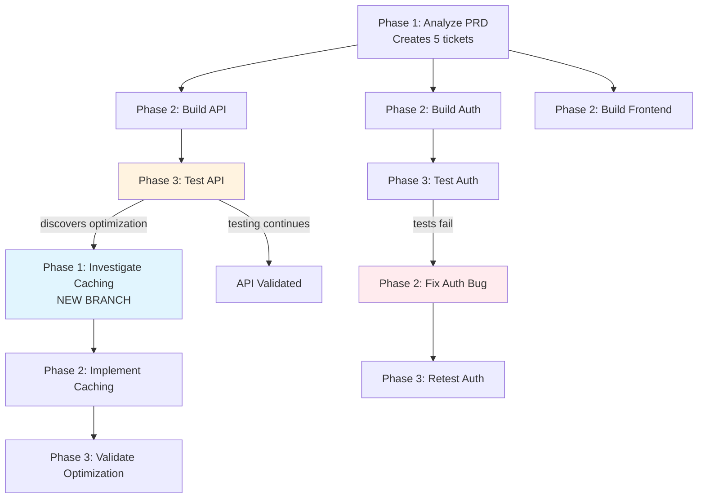

# 🔥 Hephaestus NG: A Semi-Structured Agentic Framework

<div align="center">


**From a design spec to a deployed, tested feature — autonomously, through a fixed pipeline of AI agents that verify each other's work at every step.**

[Examples](example_workflows/) • [Issue Tracker](https://github.com/hmuhlestein/HephaestusNG/issues) • [Original Hephaestus](https://github.com/Ido-Levi/Hephaestus)

</div>

---

## Why "NG"?

Hephaestus NG is the next generation of [Ido Levi's original Hephaestus](https://github.com/Ido-Levi/Hephaestus) — the semi-structured agentic framework described below, built around a simple, powerful idea: define phase *types* (analysis, implementation, validation) and let agents spawn tasks into any of them based on what they actually discover, instead of forcing every branch of a workflow to be predicted and written up front. That core engine, and the "Hephaestus Dev" pre-built workflows it ships with, are still here — unchanged in spirit.

NG is what got built on top of it: **Autopilot**, a fixed, hardened, 14-phase pipeline purpose-built for one job — running real software development end-to-end, unattended, without an agent's confident-but-wrong "done" silently becoming your team's problem. Getting there meant rebuilding most of the system underneath: a FastAPI/SQLAlchemy backend, a live React dashboard, multi-project and multi-repo support, crash-safe git worktree isolation, real authentication, and a monitoring layer that watches every agent and mechanically recovers the ones that get stuck.

---

## 🤖 NEW: Autopilot

**Ready to run software development end-to-end, unattended?** Point Autopilot at a design spec and it runs a 14-phase pipeline — each phase a fresh, focused agent, each phase's claim of "done" checked before the next one starts, and can go back to any previous step:

| # | Phase | What it does |
|---|-------|---------------|
| 1 | `product_requirements` | Extracts structured requirements from the design spec, with full project context. |
| 2 | `scope_review` | Gate: verifies the requirements are actually well-scoped before architecture work starts. |
| 3 | `architecture_design` | Produces the technical architecture and task breakdown. |
| 4 | `design_review` | Adversarial: assumes the architecture is wrong and tries to prove it — *before* a line of code is written. |
| 5 | `development` | Implements every component per the architecture. |
| 6 | `adversarial_review` | Adversarial: assumes the code is broken and reasons backward from failure modes to find out how. |
| 7 | `architectural_review` | Checks the implementation against the architecture doc for compliance drift. |
| 8 | `security_review` | Focused security pass; fixes what it finds with AWS ASH. |
| 9 | `qa_validation` | Runs comprehensive QA and validates real behavior. |
| 10 | `product_validation` | Validates the result against original design intent, not just the architecture doc. |
| 11 | `doc_review` | Reviews and fixes project documentation for accuracy and completeness. |
| 12 | `forensics_analysis` | Analyzes the whole run's agent outputs to surface prompt improvements for future pipelines. |
| 13 | `git_expert` | Autonomous git hand-off — commit, push, and (gated by review mode) merge. |
| 14 | `deploy` | Executes the feature's deployment steps. |

Autopilot deliberately trades the framework's free-form "spawn a task in any phase" branching (below) for a fixed pipeline with a narrower, more disciplined branching mechanism: any phase can `goto` an earlier one with a specific, targeted instruction, instead of inventing a new phase type on the fly. That trade is what makes it safe to run unattended:

- **Verifiable completion, not self-report.** Key phases declare a required output artifact. If an agent calls a phase "done" without producing it, completion is rejected at the source — a hallucinated "done" never gets the chance to propagate downstream.
- **Real security scanning, not a prompt asking nicely.** `security_review` runs [AWS's Automated Security Helper](https://github.com/awslabs/automated-security-helper) (`ash`) unconditionally, orchestrator-side, *before* the review agent even starts — not left to the agent to remember. The phase's completion is gated on those scan results being read and reported, and the check fails closed if it can't read them, so a skipped or silently-lost scan blocks the phase instead of shipping unreviewed.
- **Adversarial phases are load-bearing, not optional.** `design_review` and `adversarial_review` exist specifically to attack the previous phase's own output before it's trusted, the same discipline you'd want from a human reviewer whose job is to find what's wrong, not rubber-stamp what's there.
- **Goto, retry, and arbitration.** A failed `qa_validation` can `goto` `development` with exactly what to fix. When a phase exhausts its retry budget without converging, a dedicated one-shot **arbitration** agent reads the full attempt history and decides `continue` / `goto` / `fail` — a real decision from evidence, not an infinite loop or a silent stall.
- **Isolated, self-healing git worktrees.** Every feature runs in its own worktree, branched off `main`. Crashes, restarts, and concurrent agents don't corrupt shared state; merge conflicts on the way back to `main` resolve automatically via a documented newest-file-wins policy, with every resolution recorded.
- **Multiple projects in parallel, each with its own child repos.** Run several projects concurrently under a configurable concurrency cap, not just one at a time. Within a single project, add and label child repos alongside the primary one — a feature scoped to a specific child repo runs its whole pipeline (worktree, branch, merge) against that repo, not the project's primary.
- **CLI-agnostic, model-agnostic dispatch.** Each phase's session role maps to a CLI tool and model, with per-phase overrides and an automatic fallback tool/model when the primary is unavailable or saturated.
- **Mechanical recovery, not "wait and hope."** A monitoring layer (Guardian, Conductor, mechanical recovery) watches every live agent for session limits, token-limit errors, truncated responses, dead panes, and stuck-but-silent turns — and nudges or restarts them automatically.
- **Live visibility.** A React dashboard shows the design queue, the feature gallery, every phase's status, and streamed agent output in real time — so "autonomous" doesn't mean "opaque."

```bash
heph autopilot start --project-path ~/my-project
heph autopilot status
heph autopilot queue --project-path ~/my-project
```

**See Getting Started below to run it.**

---

## Hephaestus Dev: Pre-Built Workflows

**Want the general-purpose framework instead of the fixed Autopilot pipeline?** Workflow definitions live in `config/workflows/` and are auto-discovered — `autopilot` (above) and `bugfix` (a shorter pipeline for a design already scoped as a bug report) ship today, alongside `feature_architect` for per-feature decomposition. List what's registered, or drop in your own:

```bash
heph workflow list
python run_hephaestus_dev.py --path /path/to/project
```

### Codebase indexing via CodeGraph

Every project gets a real, queryable code graph, not an agent's best-effort read-through: `heph project setup` runs `codegraph init` automatically, building a symbol and call-graph index of the codebase. From there, every agent Hephaestus launches (Claude Code, pi, Codex, ...) gets CodeGraph's MCP tools wired in automatically by the installer — `codegraph_search`, `codegraph_context`, `codegraph_explore` — so an agent can look up a symbol's real callers and definitions directly instead of grepping and guessing.

---

## The Problem Original Hephaestus Framework Solves: Still Intact

*(Ido Levi, on the original Hephaestus)*

I was trying to build a system where AI agents could handle complex software projects. You know the kind: "Build me an authentication system with OAuth, JWT, rate limiting, and comprehensive tests."

Traditional agentic frameworks can branch and loop, but they have a limitation: **every branch needs predefined instructions.** You must write the task descriptions upfront for every scenario you anticipate.

But what about discoveries you didn't anticipate? When a testing agent finds an optimization opportunity, a security issue, or a better architectural pattern?

Here's what I tried instead: **Define logical phase types that are needed to solve problems - like "Plan → Implement → Test" - and let agents create tasks in ANY phase based on what they discover.**

## What Actually Happened: A Branching Tree That Builds Itself

Instead of a rigid sequence, I set up phase types:
- **Phase 1 (Analysis)**: Understanding, planning, investigation
- **Phase 2 (Implementation)**: Building, fixing, optimizing
- **Phase 3 (Validation)**: Testing, verification, quality checks

The key insight: **Agents can spawn tasks in any phase they want.**

A validation agent testing your auth system might discover an elegant caching pattern. Instead of being stuck (or following predefined branching logic you wrote), the agent:

1. **Creates a Phase 1 investigation task**: "Analyze auth caching pattern - could apply to 12 other API routes for 40% speedup"
2. **Keeps working** on their validation task
3. Another agent picks up the investigation task and explores it

The workflow just branched itself. Not because you predicted "if optimization found, spawn investigation task" - but because the agent discovered something worth exploring and had the freedom to create work for it.

This creates a **branching tree of tasks** that grows based on actual discoveries, not anticipated scenarios.

Let me show you what this looks like in practice:

### Example: Building from a PRD

I give Hephaestus a product requirements document: "Build a web application with authentication, REST API, and a React frontend."

**Phase 1 agent** reads the PRD and identifies 5 major components:
1. Authentication system
2. REST API layer
3. React frontend
4. Database schema
5. Background workers

It spawns **5 Phase 2 tasks** — one for each component. Now I have 5 agents building in parallel, each focused on one piece.

One of the **Phase 2 agents** finishes the REST API and spawns a **Phase 3 validation task**: "Test the REST API endpoints."

The **Phase 3 agent** starts testing. Everything passes. But then it notices something:

> "The auth endpoints use a caching pattern that reduces database queries by 60%. This could speed up all API routes significantly."

**Here's where it gets interesting.**

The Phase 3 agent doesn't just log this observation and move on. It doesn't get stuck because there's no "investigate optimizations" in the workflow plan.

Instead, it **spawns a new Phase 1 investigation task**: "Analyze auth caching pattern — could apply to other API routes for major performance gain."

<div align="center">

<p><em>Real-time view: 2 agents working across 3 phases, Guardian monitoring at 90% coherence</em></p>
</div>

A new Phase 1 agent spawns, investigates the caching pattern, confirms it's viable, and spawns a **Phase 2 implementation task**: "Apply caching pattern to all API routes."

Another agent implements it. Another agent validates it.

**The workflow just branched itself.** No one planned for this optimization. An agent discovered it during testing and created new work to explore it.

Meanwhile, a different Phase 3 agent is testing the authentication component. Tests fail. So it spawns a **Phase 2 bug fix task**: "Fix auth token expiry validation — current implementation allows expired tokens."

The fix agent implements the solution and spawns **Phase 3 retest**: "Validate auth fixes."

### What Just Happened?

Look at what emerged:



**This workflow built itself:**
- Started with 1 analysis task
- Branched into 5 parallel implementation tasks
- One testing phase discovered optimization → spawned 3-phase investigation branch
- Another testing phase found bugs → spawned fix → retest loop
- All coordinated through Kanban tickets with blocking relationships

<div align="center">

<p><em>Kanban board automatically built by agents: Backlog → Building → Testing → Done</em></p>
</div>

<div align="center">

<p><em>Dependency graph showing which tickets block others - the workflow structure Hephaestus discovered</em></p>
</div>

## Why This Changes Everything

**Traditional workflows:** Predict every scenario upfront → rigid plan → breaks when reality diverges

**Hephaestus approach:** Define work types → agents discover → workflow adapts in real-time

The workflow adapts in real-time based on what agents actually discover, not what we predicted upfront.

## The Semi-Structured Sweet Spot

Here's why this is "semi-structured" and why that matters:

**Fully structured workflows** (traditional frameworks):
- ❌ Require predefined prompts for every scenario
- ❌ Can branch/loop, but need fixed instructions for each path
- ❌ Must anticipate all discoveries upfront

**Fully unstructured agents** (chaos):
- ❌ No coordination
- ❌ Duplicate work
- ❌ Contradictory changes
- ❌ No clear success criteria

**Semi-structured (Hephaestus)**:
- ✅ **Phase definitions** provide work type structure and guidelines
- ✅ **Agents write task descriptions** dynamically based on discoveries
- ✅ **Kanban tickets** coordinate work with blocking relationships
- ✅ **Guardian monitoring** ensures agents stay aligned with phase goals
- ✅ Workflow adapts to what agents actually find, not what you predicted

You get **structure where it matters**:
- Phase types define what kind of work is happening
- Done definitions set clear completion criteria
- Guardian validates alignment with phase instructions
- Tickets track dependencies and prevent chaos

And **flexibility where you need it**:
- Agents create detailed task descriptions on the fly
- No need to predefine every possible branch
- Discoveries drive workflow expansion in real-time
- New work types emerge as agents explore

Autopilot is this same sweet spot held to a tighter, fixed shape for one specific, high-stakes job — see above.

## 🚀 Getting Started

### Prerequisites

- **Python 3.12+**
- **tmux** - Terminal multiplexer for agent isolation
- **Git** - Your project must be a git repository
- **Node.js & npm** - For the frontend UI
- **[uv](https://docs.astral.sh/uv/getting-started/installation/)** - Python package/venv manager
- **Claude Code**, **Codex**, **OpenCode**, **Droid**, **pi**, or **Swarm** - CLI AI tool that agents run inside
- **API Keys**: OpenRouter (default), OpenAI, or Anthropic

Unlike the original, **Docker is not required by default** — the vector store (turbovec) runs local and in-process. Qdrant is available as an opt-in alternative (`--with-docker`) if you'd rather run that instead.

### Install

`scripts/install.sh` handles the rest: Python venv, dependencies, database init, frontend build, [AWS ASH](https://github.com/awslabs/automated-security-helper) for the security review phase (local `uvx` mode, no Docker), and MCP configuration for whichever of Claude Code / Codex / OpenCode / pi you have installed.

```bash
git clone https://github.com/hmuhlestein/HephaestusNG.git
cd HephaestusNG
./scripts/install.sh
```

Once this repo is public, the same script also supports a remote install with no clone step:

```bash
curl -sSL https://raw.githubusercontent.com/hmuhlestein/HephaestusNG/main/scripts/install.sh | bash
```

Useful flags: `--prefix DIR` (default `~/.hephaestus`), `--with-docker` (opt into Qdrant instead of turbovec), `--skip-frontend`, `--dev` (pytest/black/mypy/ruff), `--update` (pull latest and reinstall). Run `./scripts/install.sh --help` for the full list.

The installer starts Hephaestus for you at the end. This checks what's set up and running:

```bash
heph status
```

### Get Started

Run Autopilot end-to-end on a project:

```bash
heph project setup <name> <path>     # create and activate a project
heph autopilot start --project-path ~/my-project
```

...or run one of Hephaestus Dev's pre-built workflows:

```bash
python run_hephaestus_dev.py --path /path/to/project
```

<div align="center">

<p><em>Real-time observability: Watch agents work in isolated CLI sessions as they discover and build the workflow</em></p>
</div>

---

**Want to learn more?** See [CONTRIBUTING.md](CONTRIBUTING.md) for a full development setup, and [CLAUDE.md](CLAUDE.md) for this project's architecture and conventions in depth. The original [Hephaestus documentation](https://ido-levi.github.io/Hephaestus/) covers the shared framework's architecture in more depth still.

---

## 🤝 Getting Help

- 🐛 **[Issue Tracker](https://github.com/hmuhlestein/HephaestusNG/issues)** - Report bugs and request features
- 📖 **[Original documentation](https://ido-levi.github.io/Hephaestus/)** - Complete guides, API reference, and tutorials for the shared framework

---

<div align="center">

**Hephaestus: Where workflows forge themselves**

*Named after the Greek god of the forge, Hephaestus creates a system where agents craft the workflow as they work*

**License:** AGPL-3.0

</div>
